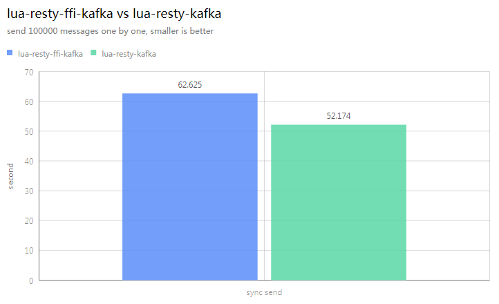

# lua-resty-ffi-kafka
The openresty kafka client library that encapsulates kafka-go

## Quickstart

[Install lua-resty-ffi first.](https://github.com/kingluo/lua-resty-ffi#install-lua-resty-ffi-via-luarocks)

```bash
# download and build
cd /opt
git clone https://github.com/kingluo/lua-resty-ffi-kafka
cd lua-resty-ffi-kafka
make

# start kafka container
cd demo
docker compose up -d

# create topic
python3 create-topic.py

# start nginx
mkdir logs
LD_LIBRARY_PATH=/opt/lua-resty-ffi-kafka/:/usr/local/lib/lua/5.1 \
nginx -p $PWD -c nginx.conf

# test sync send
curl http://localhsot:20000/send?cnt=1
```

## Background

lua-resty-kafka has below issues:

* the author do not maintain the project positively anymore
* features missing
  * kafka version compatibility
  * compression
  * consumer group
  * reconnections
  * more SASL methods
  * ...
* bugs
  * no necessary metadata refresh ahead of send/receive
  * code reentrancy problem (e.g. concurrent sync sends)
  * ...

[kafka-go](https://github.com/segmentio/kafka-go) is a popular and active kafka client library.

Why not encapsulate it so that we could reuse it in openresty?

[lua-resty-ffi](https://github.com/kingluo/lua-resty-ffi) provides an efficient and generic API to do hybrid programming
in openresty with mainstream languages (Go, Python, Java, Rust, Nodejs).

`lua-resty-ffi-kafka = lua-resty-ffi + kafka-go`

## Benchmark



For the time being, lua-resty-ffi-kafka is 80% of the performance of lua-resty-kafka.
